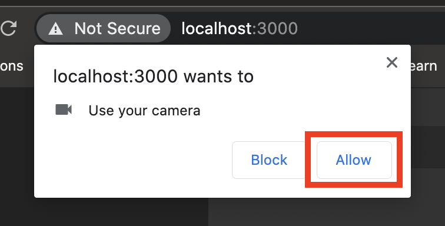
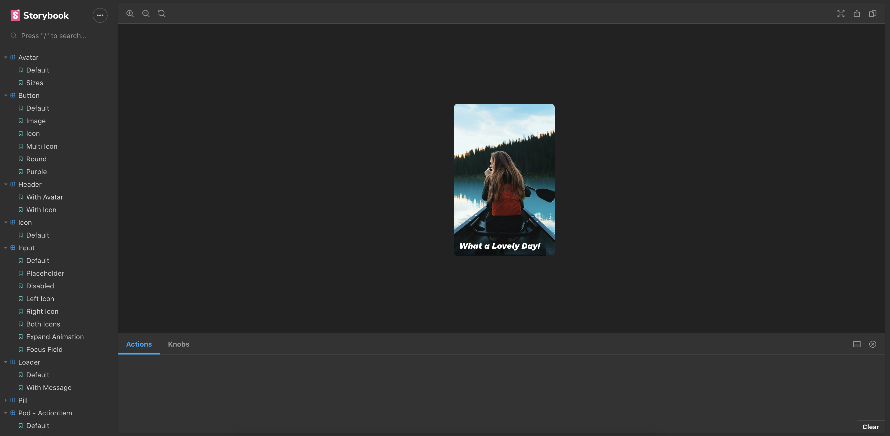
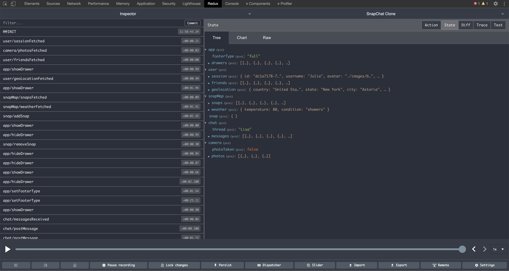
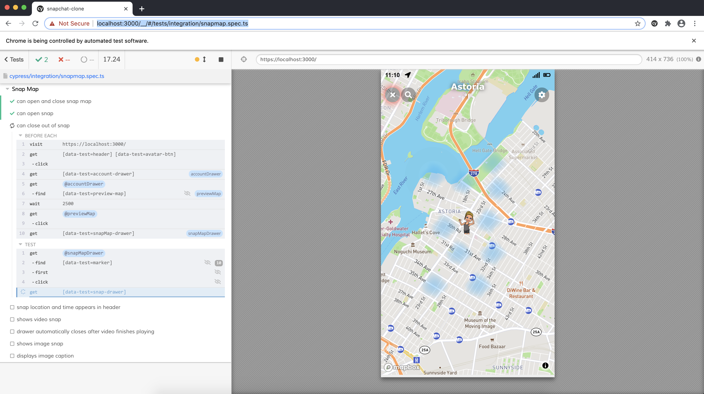

<h1 align="center">👻 SnapChat Clone</h1>

# ⚡️Breakdown

  

    <a href="public/github/snapchat.mp4">
      
       
      👆Click to see all implemented features
    </a>
  

  

  <h2 align="center">
    <a href="https://google.com">[LIVE DEMO]</a>
  </h2>

- Built with `React`
  - Functional components using hooks
  - Feature based folder structure
  - `common` directory for shared components
  - Bootstraped using `Create React App`
- Global state management via `Redux`
  - Follows the modular [ducks](https://github.com/erikras/ducks-modular-redux) proposal to bundle action types, creators and reducers all in one file (reducing the need to jump around)
  - Flat state tree (avoids deeply nested properties)
  - Follows official Redux styleguide recomendations for naming actions and action types, e.g. `camera/photosFetched` vs `SET_PHOTOS`
  - Uses `thunk` middleware for async operations
- Type checked with `Typescript`
- Unit tested with `Jest` and `Enzyme`
- End-to-end tested with `Cypress`
- Custom component library showcased in `Storybook`
- Linted using `Eslint`
- Code is auto formatted using `Prettier` (ran as a pre-commit git hook) before it gets pushed to the repo
- Feels close to a native app if you "add to homescreen" on mobile

<h2 align="center">
  <a href="https://google.com">[LIVE DEMO]</a>
</h2>

  

# 💿 Installation

Run these commands in the terminal:

1. `> git clone git@github.com:TowhidKashem/snapchat-clone.git`
2. `> cd snapchat-clone`
3. `> npm install`

- This will:
  - Install the dependencies in package.json
  - Checkout [jeelizFaceFilter](https://github.com/jeeliz/jeelizFaceFilter_) package (used for the filters) and set it to the last version this project was tested and confirmed to work with
  - Run `gulp` to concatenate, minify and transpile the files located in `public/filters/source/*.js` into a single file called `filters.min.js`

4. This part is optional but strongly recomended, without it you won't be able to view any of the snap map features:

   - Make a Mapbox account and [get a free API key](https://docs.mapbox.com/help/glossary/access-token/)
   - Rename the `.env.sample` file at the root of the project to just `.env`
   - Inside enter your new API key, for example:
     - Before: `REACT_APP_MAP_BOX_API_KEY=<REPLACE_WITH_API_KEY>`
     - After: `REACT_APP_MAP_BOX_API_KEY=xy.abc123`

5. `> npm start`

- The app should open automatically in your browser at `https://localhost:3000/`
  - In Chrome you will receive a "Your connection is not private" error
    - Click "Advanced" > "Proceed to localhost (unsafe)"
      - You'll get this warning because the app uses a self signed `https` certificate. The `getUserMedia` API used by the camera requires the `https` protocol so we run the dev server in https mode.
  - After this you will be prompted to give access to your webcam, click "Allow"

|               Step 1                |               Step 2                |                Step 3                |
| :---------------------------------: | :---------------------------------: | :----------------------------------: |
|  |  |  |

6. You're all set!

# 🦮 Guides

  

Not all the buttons are actionable, many of them are there just for show since this is a minimal demo. [This video]() shows all the things you can currently do.

Where it's not obvious which buttons actually work I added a red box-shadow as guide:

## 🛠 Tooling

|            Storybook             |            Redux Dev Tools             |
| :------------------------------: | :------------------------------------: |
|  |  |

- The app has it's own component library and uses Storybook to showcase it. You can run Storybook using the command `npm run storybook`.
- The Redux Devtools Extension is implemented in the app, it makes things like viewing the state, state flow and debugging much easier, to use it you need to install the browser extension [here](https://chrome.google.com/webstore/detail/redux-devtools/lmhkpmbekcpmknklioeibfkpmmfibljd?hl=en) or [here](https://addons.mozilla.org/en-US/firefox/addon/reduxdevtools/).

# 🧪 Testing

There are two types of tests in the app (end to end and unit).

## End to end tests:

- All e2e tests are located in `cypress/integration/*.spec.ts`
  - To run these use the command `npm run e2e`
  - This will spawn the Cypress electron app
  - Click "Run all specs", Cypress will spawn a Chrome instance and you will see all the tests as they're being run:

|                Step 1                |                                            Step 2                                            |
| :----------------------------------: | :------------------------------------------------------------------------------------------: |
|  |  👆Click to see the entire test suite being run |

- Alternatively you can also run the e2e suite in the terminal using the command `npm run e2e-headless`. This command still generates videos in `cypress/videos/*.mp4` of the tests being run should you need them.

## Unit tests:

    

- All the shared components in the `common` directory have unit tests inside their respective folders. They end with a `*.test.tsx` extension.
- To run the unit test suite use the command `npm run test` then enter `a` to run all tests
- These tests are also automatically run on each commit, if there are any failures the commit will also fail

# 📝 Misc Notes

- In addition to running on the localhost domain the app is also available on your network at `https://192.168.0.185:3000` (useful for viewing on mobile)
- If you want to make changes to the filter files, run the command `cd filters && gulp watchJS` to watch for changes
- If you want to browse the production build run the commands `npm run build && npm run serve`, then navigate to `http://localhost:5000` locally or `http://192.168.0.185:5000` on the network
- Webpack root dir is set to `src` which means we can use clean import paths like these `import Foo from common/Foo` vs messy relative paths like `import Foo from ../../common/Foo`
- This is purely a front end demo project, the "api" is nothing but a bunch of hard coded json files located in `/public/api/*.json`. All data is dummy data!

# ⚠️ Contributing

Please note **I will not be accepting PR's on this project** since it is part of my personal portfolio. You're more than welcome to fork and maintain your own version if you like!

# ⚖️ License

[MIT](https://opensource.org/licenses/MIT)
